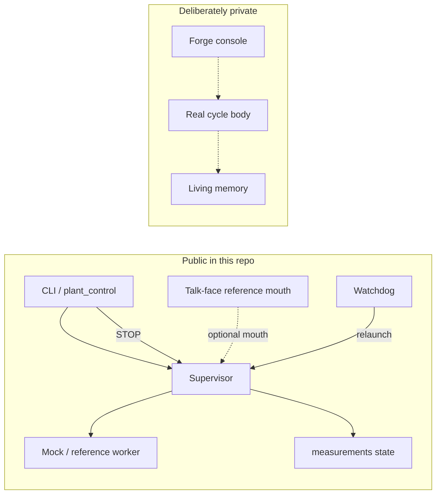

# Public vs mock vs private (overlay)

Use with [ARCHITECTURE.md](ARCHITECTURE.md).

| Piece | Shipping status |
|-------|-----------------|
| Supervisor / watchdog / STOP / heartbeat files | **Public, real** |
| Talk-face reference mouth | **Public, mock spine** |
| Continuity demo pulse | **Public, mock** |
| Forge + living memory + real cycle body | **Private local install** |
